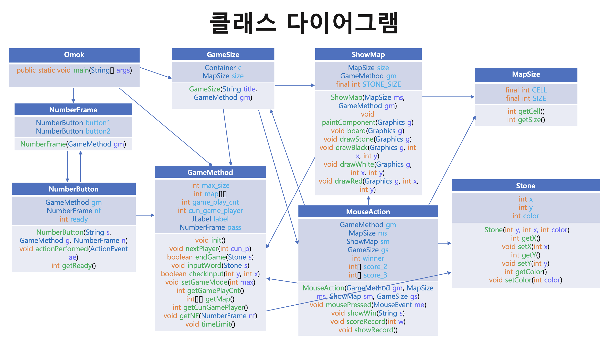

# Omok
- 팀원  
`윤지수` `임수민` `최우빈`
 

- 기본 규칙  
  - 오목 승리 규칙: 플레이어의 바둑돌이 일렬로 다섯 개가 나란히 배치되면 승리한다.
  - 추가 규칙 1: 플레이어의 수는 2명 또는 3명으로 선택할 수 있다.
  - 추가 규칙 2: 10초 안에 바둑돌을 두지 않으면 다음 플레이어에게 기회가 넘어간다.
 

- 요구사항  
  - 게임 시작 전에 플레이어 수를 선택할 수 있어야 한다.
  - 마우스 클릭을 통해 원하는 위치에 바둑돌을 둘 수 있어야 한다.
    - 조건 1: 바둑돌이 이미 놓여진 위치에 새로운 바둑돌을 겹쳐서 둘 수 없다.
    - 조건 2: 바둑판 바깥에 바둑돌을 둘 수 없다.
  - 제한 시간이 지나면 다음 플레이어에게 기회가 넘어가야 한다.
  - 바둑돌이 연속으로 다섯 개 놓여지면 승리 판정을 내려야 한다.
    - 조건: 가로, 세로, 대각선의 모든 방향을 고려한다.
  - 승리 판정 후 승리 플레이어의 점수를 1점 올려야 한다.
  - 모든 플레이어의 현재 점수를 점수판으로 보여주어야 한다.
  - 재시작 여부를 묻고 게임을 다시 시작하거나 종료할 수 있어야 한다.
 

- 사용설명서  
  1. 플레이어의 수를 선택한다.
  2. 게임이 시작된다.
  3. 10초의 시간 제한을 두고 수를 둘 수 있다.
  4. 연속으로 다섯 개의 돌을 둔 플레이어가 승리한다.
  5. 승리 시 게임이 종료되며, 콘솔창에 점수판이 출력된다.
  6. 재시작 또는 게임 종료를 할 수 있다.
 

- 클래스 다이어그램

